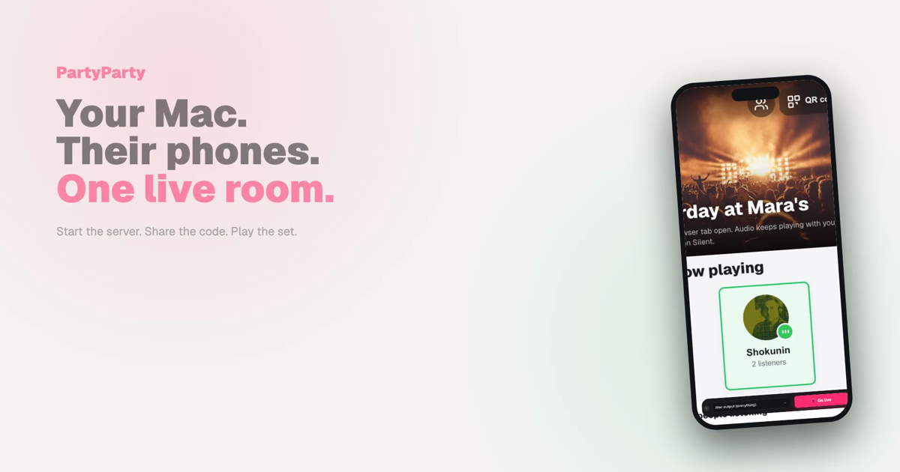

# PartyParty

**Turn a Mac into a live headphone party.**

PartyParty is a macOS menu-bar app that broadcasts a DJ set to phones on the
same venue Wi-Fi. Guests scan the in-app QR code, press play in Safari, and
keep listening when the phone is locked. They install nothing and create no
account.

[Website](https://partyparty.party) ·
[Join the public TestFlight beta](https://testflight.apple.com/join/HPRAgyJk) ·
[Report a problem](https://github.com/tetrisgm/partyparty/issues)



## Try the beta

PartyParty is currently a public beta for Apple-silicon Macs running macOS 26
or newer. Install TestFlight from the Mac App Store, open the
[PartyParty invitation](https://testflight.apple.com/join/HPRAgyJk), and choose
Install.

Start PartyParty on the Mac, select the audio source, and press **Go Live**.
Guests scan the QR code with an iPhone and listen in Safari. Ordinary venue
Wi-Fi works without an internet connection; an optional relay handles networks
that isolate guests from one another.

The beta is real software and may still have rough edges. Before using it for
an important event, test the exact Mac, phones, Wi-Fi, and audio setup you plan
to use. Questions and bug reports are welcome through
[GitHub Issues](https://github.com/tetrisgm/partyparty/issues) or
[support@partyparty.party](mailto:support@partyparty.party).

## Product contract

- Live audio, photos, videos, comments, reactions, and requests originate on
  the Mac and are never stored as a cloud party or replay. Photos and videos
  remain available in direct mode.
- Guests need no account. Normal Wi-Fi and offline travel-router parties use
  the direct mode and need no internet.
- The normal guest link is HTTPS and the stream is LL-HLS. A narrowly gated
  HTTP emergency link exists only when there is no internet relay and the local
  resolver is proven unable to resolve the secure hostname; locked-screen
  playback is not promised on that degraded path.
- iPhones use native HLS/AVPlayer. This is the only supported Apple playback
  engine because it is smooth and survives screen lock.
- The venue provides Wi-Fi. PartyParty does not create a hotspot, captive portal,
  or Internet Sharing configuration.
- The Mac selects one room-wide connection mode. Wi-Fi only is the default, so
  direct mode keeps traffic at the venue. If the DJ enables Wi-Fi + cloud and a
  phone proves that the Wi-Fi isolates nearby devices, relay mode contributes
  one copy of the stream to the relay origin for fan-out. HLS traffic has strict
  priority. Guest photos use a capped, throttled secondary path, and videos are
  disabled in relay mode. The relay does not create public event pages or retain
  party content.

## Run from source

Requirements: macOS 26+, Apple Silicon, Go 1.26+, Xcode command-line tools, and
MediaMTX for source builds. Release bundles include FFmpeg, MediaMTX, and the
capture helper.

```sh
make run
```

Open `http://localhost:8000/dj`, choose a capture source, and press
Go Live. Guests use the HTTPS QR shown in the console.

The production stream profile is fixed at 320 kbps stereo AAC-LC, 500 ms LL-HLS
segments, 150 ms parts, and 48 retained segments. Do not add alternate playback
engines or "safe" stream presets without new physical field evidence.

The source is public for inspection under an
[all-rights-reserved source-visible notice](LICENSE). No permission to reuse,
modify, or distribute it is granted by the repository being public.

## Permissions

The App Store build requests only what the selected workflow needs:

- Local Network, to serve guests on venue Wi-Fi.
- System Audio Recording, when capturing the Mac's output.
- Microphone, when capturing a microphone, controller, or line input.
- Login Item, only if the DJ explicitly enables launch at login.

It does not request an administrator password, install privileged helpers, alter
network settings, or require Screen Recording.

## Build and verify

The full gate, in the order it is worth running:

```sh
go build ./...
go build -tags bundle ./...        # the variant that actually ships
go vet -tags bundle ./...
go vet -tags embedhelpers ./...
go test ./...
go test -race ./...
npm test                           # source and render checks, seconds
npm run gate                       # the above plus the real browser stream E2E
cd app && swift build && swift test
cd cloudflare && node test/smoke.mjs && npx wrangler deploy --dry-run
```

`go build ./...` on its own compiles only the runtime variant. The app ships
with `bundle` and `embedhelpers`, so a build that never vets those tags has not
vetted what users run.

`npm test` is source-and-render only. `npm run gate` adds
`scripts/stream-e2e.mjs`, which builds the Go server, starts a real MediaMTX and
a real ffmpeg on throwaway ports, and drives the real guest page in a headless
browser. It is the only check that asserts the shipping playlist shape, so a run
that skips it proves nothing about the stream.

Playback positioning is not covered by any of the above, because none of them
can hear AVPlayer:

```sh
npm run soak:lab                   # every playlist tier, real AVPlayers, throwaway stack
scripts/soak-playback.sh <url> 10  # one real stream, ten minutes, keep the log
```

See `docs/receipts/README.md` for what those numbers mean and which ones are
evidence. Do not run either while the Mac is broadcasting.

`scripts/build-app.sh` creates the sandboxed Mac App Store app.
`scripts/build-standalone.sh` creates the separate Developer ID beta. See
`docs/DISTRIBUTION.md`.
